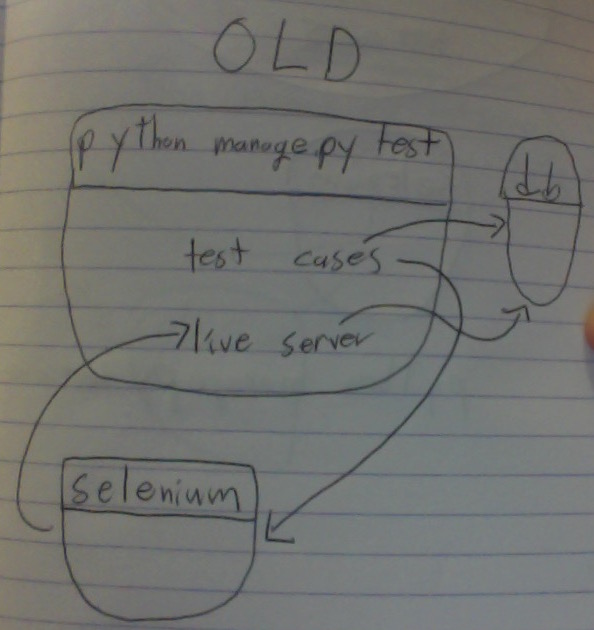
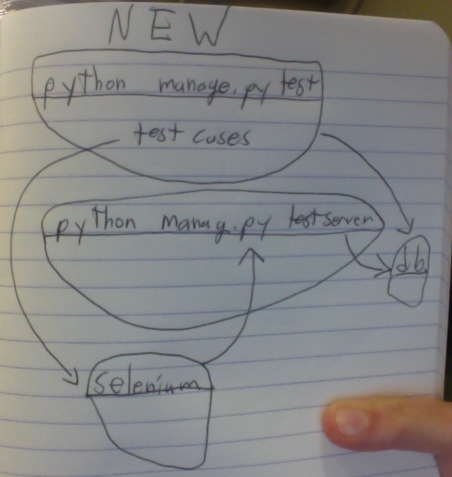

# `django-externaltestserver`
[](https://pypi.python.org/pypi/django-externaltestserver)
[](https://travis-ci.org/saulshanabrook/django-externaltestserver)

## How?
1. `pip install django-externaltestserver`.
2. Set `EXTERNAL_TEST_SERVER` in your settings
3. Change test cases to inherit from
   `externaltestserver.ExternalLiveServerTestCase` instead of
   `LiveServerTestCase`.
4. (optional) Add `externaltestserver` to `INSTALLED_APPS` to run
   `python manage.py testserver <port> [--static]` in another process.

## Why?

### External Server
We have a CI system that pushes to a staging server after all tests pass.
We wanted to re-run our selenium test against the staging server, to make
sure there are no regressions moving from a dev to a staging environment.

To do this, we just have to set the `EXTERNAL_TEST_SERVER`
setting to our staging server (like `http://magicapp-staging.herokuapp.com/`)
and make sure our integration tests inherit from `externaltestserver.ExternalLiveServerTestCase`
so that they get the correct `live_server_url`.


### Docker

#### Problem

Testing Selenium in Django with Docker is
[not obvious](http://stackoverflow.com/questions/32408429/running-django-tests-with-selenium-in-docker).

The problem is that there is a circular dependency between the testing
container and the selenium container. The test container needs to access
selenium in order to send commands and recieve responses. The selenium
container needs to access the testing container, in order to hit the server.



We might hope we could represent this relation this in our `docker-compose.yml`

```yaml
db:
    image: postgres
test:
    build: .
    command: python manage.py test
    links:
        - db
        - selenium
selenium:
    image: selenium/standalone-chrome
    ports:
        - "4444:4444"
        - "5900:5900"
    links:
        - test
```

But alas `ERROR: Circular import between test and selenium and db`.

I was previously using
[an alternative solution](https://github.com/docker/compose/issues/1991#issuecomment-138139493),
by placing the the `test` container in the same network as the `selenium`
container, so that they could access each other.


```yaml
db:
    image: postgres
test:
    build: .
    command: python manage.py test
    links:
        - db
    net: "container:selenium"
selenium:
    image: selenium/standalone-chrome
    ports:
        - "4444:4444"
        - "5900:5900"
```

This stopped working with Docker Compose 1.5.0 / Docker 1.9.0 with
`ERROR: Conflicting options: --net=container can't be used with links. This would result in undefined behavior`.

#### Solution

The simplist solution to me seemed to be to break up the test command into
two seperate Docker containers. One would handle serving the server, the other
would just run the tests.



That way there are no cyclical dependencies.

```yaml
db:
    image: postgres:9.5
test:
    build: .
    # sleep for https://github.com/docker/compose/issues/374#issuecomment-156546513
    command: bash -c "sleep 5; python manage.py test --keepdb"
    links:
        - db
        - selenium
    environment:
        - EXTERNAL_TEST_SERVER=http://testserver:8000/
        - SELENIUM_HOST=http://selenium:4444/wd/hub
selenium:
    image: selenium/standalone-chrome:2.48.2
    links:
        - testserver
testserver:
    build: .
    # sleep for https://github.com/docker/compose/issues/374#issuecomment-156546513
    command: bash -c "sleep 5; python manage.py testserver 8000 --static"
    expose:
      - "8000"
    links:
        - db

```

Then just make sure we are picking up the host in the settings:

```python
# settings.py
import os

EXTERNAL_TEST_SERVER = os.environ.get('EXTERNAL_TEST_SERVER', None)
```

And that your tests are inheriting from `externaltestserver.ExternalLiveServerTestCase`
and accesing the right selenium server:

```python
# test_integration.py
import os

from selenium import webdriver
from selenium.webdriver.common.desired_capabilities import DesiredCapabilities
from externaltestserver import ExternalLiveServerTestCase

from items.models import Item


class IntegrationTest(ExternalLiveServerTestCase):
    def setUp(self):
        self.browser = webdriver.Remote(
            command_executor=os.environ['SELENIUM_HOST'],
            desired_capabilities=DesiredCapabilities.CHROME
        )

    def test_item_count(self):
        Item.objects.create()
        self.browser.get(self.live_server_url)
        self.assertIn("1", self.browser.page_source)
```

Then you can run all the tests with `docker-compose run test`.


## Development

First choose what python and django versions you wanna test on:

```bash
sed -e 's/${PYTHON_VERSION}/3.5/g' -e 's/${DJANGO_VERSION}/1.8/g' Dockerfile.tmpl  > Dockerfile
```

Then run the tests:

```bash
docker-compose run test
```


To deploy a new version:

```
# change version in setup.py
python setup.py publish
git tag <version number>
git push --tags
```

